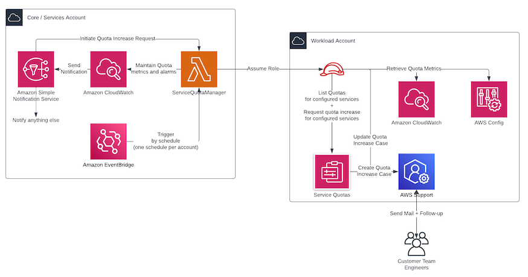

# Service Quotas Manager




This Service Quotas Manager can be installed as part as an AWS Organization or individual account to manage service quotas and become (more) demonstrably in control of them. It currently supports the following:

1. Collection of service quotas and metrics per configured account, storing usage metrics centrally. Usage metrics can be derived from CloudWatch or AWS Config. The latter obviously requires AWS Config to be enabled in your target account.

1. Automated discovery of used services by querying AWS Cost Explorer.

1. Management of alarms on your service quotas with configurable thresholds per quota. Alarms can be disabled by omitting the alerting config.

1. Optionally an SNS topic can be provided as alarm action.

1. Automated requesting of service quota increases by configurable steps and motivations for support case updates (requires at least AWS Business Support and alarms to be enabled).

Please see [supported quotas](https://github.com/schubergphilis/terraform-aws-mcaf-service-quotas-manager/blob/main/SUPPORTED_QUOTAS.md) for an overview of supported services and service quotas.

## Prerequisites & considerations

* To support collection of usage metrics from AWS Config, AWS Config needs to be enabled in every target account in your organization. This is usually the case in enterprise organizations.

* To support automated quota increase requests at least AWS Business Support is required.

* This service quota manager relies on custom CloudWatch metrics ($0.30/metric/month) and CloudWatch alarms ($0.10/alarm/month). Services to monitor are configurable; more services monitored means increased cost.

* Most quotas are applied per region. This Service Quota Manager operates in a single region. Install the Service Quota Manager in more regions in order to monitor quotas in more regions.

### Remarks on usage collection via AWS Config

AWS Service Quotas by default only works with AWS CloudWatch. A limited set of Service Quotas have a reference to a CloudWatch metric that is collected by default or as soon as one starts using a service. A lot of service quotas however do not have metrics available. There is - for example - no metric for the number of ENI's assigned to a Lambda function, but there is a service quota for it. This tool leverages AWS config - if enabled - to collect that information; because you rather know upfront if you can request a quota increase or should re-architect your solution.

In order to collect usage from AWS Config, this tool uses the 'advanced query' functionality in AWS Config. The queries return a list of serialized JSON objects as a resultset and a JMESPath expression is used to convert that resultset to a re-usable number. Extending the queries - and thus the number of supported service quotas - is relatively easy and can be done by extending the custom collection queries file.

As an example, in [custom_collection_queries.json](https://github.com/schubergphilis/terraform-aws-mcaf-service-quotas-manager/blob/main/service_quotas_manager/service_quotas_manager/custom_collection_queries.json):

```jsonc annotate
{
  // The service code as defined by AWS Service Quotas. The service code can be derived from the quota ARN in the AWS console.
  "acm": {
     // The quota code as defined by AWS Service Quotas. The quota code can be derived from the quota ARN in the AWS console.
    "L-D2CB7DE9": {
      "parameters": {
        // The expression to use as advanced query. This is fed to the select_resource_config API call. It's easy to test expressions in the AWS console.
        "expression": "SELECT resourceId WHERE resourceType = 'AWS::ACM::Certificate' AND configuration.type = 'IMPORTED'",
        // The JMESPath expression to execute on the expression result. JMESPath expressions are also used by the --query flag when using the AWS CLI.
        "jmespath": "length([])"
      },
      // The type of custom collection query, to enable future support for more services.
      "type": "config"
    }
  }
}
```

## Setup

General steps to install:

1. Install the service quotas manager in a central account.
2. Setup the assumable roles in all target accounts that require monitoring.

### Central Account

> [!TIP]
> Consider using a services account or audit account to deploy the service quotas manager in.

A minimal setup can be done like this:

```hcl
module "service_quotas_manager" {
  source  = "schubergphilis/mcaf-service-quotas-manager/aws"
  version = ">= 0.1.0"

  quotas_manager_configuration = [
    {
      account_id = "123456789000"
      alerting_config = {
        default_threshold_perc = 75
        notification_topic_arn = "arn:aws:sns:eu-west-1:123456789000:service-quotas-manager-notifications"
      }
    }
  ]
}
```

See the [examples](https://github.com/schubergphilis/terraform-aws-mcaf-service-quotas-manager/tree/main/examples) for more examples on how to configure thresholds and auto-increase rules.

### Target Accounts

#### Roles

This manager works by assuming roles in your target accounts from a single central management account to collect applied service quotas and usage metrics. Every account you want to be managed requires a role that can be assumed by the service quota manager. Setting up these roles is not part of this solution but could be part of - for example - your account baseline. It's already part of the MCAF [account baseline](https://github.com/schubergphilis/terraform-aws-mcaf-account-baseline).

Each role requires the following trust policy:

```json
{
	"Version": "2012-10-17",
	"Statement": [
	  {
			"Sid": "AllowServiceQuotasManager",
			"Effect": "Allow",
			"Principal": {
				"AWS": "arn:aws:iam::<manager_account_id>:role/ServiceQuotasManagerExecutionRole-<region_name>"
			},
			"Action": "sts:AssumeRole"
		}
	]
}
```

Each role requires the following policies attached:

1. AWS Managed policy `ServiceQuotasReadOnlyAccess`.
2. A custom or inline policy with the following permissions:

```json
{
  "Version": "2012-10-17",
  "Statement": [
    {
      "Sid": "AllowConfigReadAccess",
      "Effect": "Allow",
      "Action": "config:SelectResourceConfig",
      "Resource": "*"
    },
    {
      "Sid": "AllowSupportAccess",
      "Effect": "Allow",
      "Action": [
        "support:DescribeSeverityLevels",
        "support:AddCommunicationToCase"
      ],
      "Resource": "*"
    },
    {
      "Sid": "AllowOptionalCeAccessForServiceAutoDiscovery",
      "Effect": "Allow",
      "Action": [
        "ce:GetCostAndUsage"
      ],
      "Resource": "*"
    },
    {
      "Sid": "AllowServiceQuotaAccess",
      "Effect": "Allow",
      "Action": [
          "servicequotas:RequestServiceQuotaIncrease"
      ],
      "Resource": "*"
    }
  ]
}
```

> [!TIP]
> We do not pin modules to versions in our examples. We highly recommend that in your code you pin the version to the exact version you are using so that your infrastructure remains stable.

<!-- BEGIN_TF_DOCS -->
## Requirements

| Name | Version |
|------|---------|
| <a name="requirement_terraform"></a> [terraform](#requirement\_terraform) | >= 1.6.0 |
| <a name="requirement_archive"></a> [archive](#requirement\_archive) | >= 2.4.0 |
| <a name="requirement_aws"></a> [aws](#requirement\_aws) | >= 5.25.0 |

## Providers

| Name | Version |
|------|---------|
| <a name="provider_archive"></a> [archive](#provider\_archive) | >= 2.4.0 |
| <a name="provider_aws"></a> [aws](#provider\_aws) | >= 5.25.0 |

## Modules

| Name | Source | Version |
|------|--------|---------|
| <a name="module_service_quotas_manager_bucket"></a> [service\_quotas\_manager\_bucket](#module\_service\_quotas\_manager\_bucket) | schubergphilis/mcaf-s3/aws | ~> 0.12.0 |
| <a name="module_service_quotas_manager_lambda"></a> [service\_quotas\_manager\_lambda](#module\_service\_quotas\_manager\_lambda) | schubergphilis/mcaf-lambda/aws | ~> 1.1.2 |

## Resources

| Name | Type |
|------|------|
| [aws_cloudwatch_event_rule.trigger_service_quotas_manager_on_alarm](https://registry.terraform.io/providers/hashicorp/aws/latest/docs/resources/cloudwatch_event_rule) | resource |
| [aws_cloudwatch_event_target.trigger_service_quotas_manager_on_alarm](https://registry.terraform.io/providers/hashicorp/aws/latest/docs/resources/cloudwatch_event_target) | resource |
| [aws_iam_policy.service_quotas_manager_schedules](https://registry.terraform.io/providers/hashicorp/aws/latest/docs/resources/iam_policy) | resource |
| [aws_iam_role.service_quotas_manager_execution_role](https://registry.terraform.io/providers/hashicorp/aws/latest/docs/resources/iam_role) | resource |
| [aws_iam_role.service_quotas_manager_schedules](https://registry.terraform.io/providers/hashicorp/aws/latest/docs/resources/iam_role) | resource |
| [aws_iam_role_policy.service_quotas_manager_execution_policy](https://registry.terraform.io/providers/hashicorp/aws/latest/docs/resources/iam_role_policy) | resource |
| [aws_iam_role_policy_attachment.service_quotas_manager_schedules](https://registry.terraform.io/providers/hashicorp/aws/latest/docs/resources/iam_role_policy_attachment) | resource |
| [aws_lambda_permission.trigger_service_quotas_manager_on_alarm](https://registry.terraform.io/providers/hashicorp/aws/latest/docs/resources/lambda_permission) | resource |
| [aws_s3_object.service_quotas_manager_config](https://registry.terraform.io/providers/hashicorp/aws/latest/docs/resources/s3_object) | resource |
| [aws_scheduler_schedule.sqm_collect_service_quotas](https://registry.terraform.io/providers/hashicorp/aws/latest/docs/resources/scheduler_schedule) | resource |
| [aws_scheduler_schedule_group.service_quotas_manager](https://registry.terraform.io/providers/hashicorp/aws/latest/docs/resources/scheduler_schedule_group) | resource |
| [archive_file.service_quotas_manager_source](https://registry.terraform.io/providers/hashicorp/archive/latest/docs/data-sources/file) | data source |
| [aws_caller_identity.current](https://registry.terraform.io/providers/hashicorp/aws/latest/docs/data-sources/caller_identity) | data source |
| [aws_region.current](https://registry.terraform.io/providers/hashicorp/aws/latest/docs/data-sources/region) | data source |

## Inputs

| Name | Description | Type | Default | Required |
|------|-------------|------|---------|:--------:|
| <a name="input_kms_key_arn"></a> [kms\_key\_arn](#input\_kms\_key\_arn) | The ARN of the KMS key to use with the configuration S3 bucket and scheduler | `string` | n/a | yes |
| <a name="input_quotas_manager_configuration"></a> [quotas\_manager\_configuration](#input\_quotas\_manager\_configuration) | The configuration for the service quotas manager | <pre>list(object({<br>    account_id        = string<br>    role_name         = optional(string, "ServiceQuotasManagerRole")<br>    selected_services = optional(list(string), [])<br>    alerting_config = optional(object({<br>      default_threshold_perc = number<br>      notification_topic_arn = optional(string, "")<br>      rules = optional(<br>        map(<br>          map(<br>            object({<br>              threshold_perc = optional(number, null)<br>              ignore         = optional(bool, false)<br>            })<br>          )<br>        ), {}<br>      )<br>      }), {<br>      default_threshold_perc = 75<br>      notification_topic_arn = ""<br>      rules                  = {}<br>    })<br>    quota_increase_config = optional(map(map(object({<br>      step              = optional(number)<br>      factor            = optional(number)<br>      motivation        = string<br>      cc_mail_addresses = list(string)<br>    }))), {})<br>  }))</pre> | n/a | yes |
| <a name="input_bucket_name"></a> [bucket\_name](#input\_bucket\_name) | The optional name for the service quotas manager configuration bucket, overrides `bucket_prefix`. | `string` | `null` | no |
| <a name="input_bucket_prefix"></a> [bucket\_prefix](#input\_bucket\_prefix) | The prefix for the service quotas manager configuration bucket. | `string` | `"service-quotas-manager"` | no |
| <a name="input_schedule_timezone"></a> [schedule\_timezone](#input\_schedule\_timezone) | The timezone to schedule service quota metric collection in | `string` | `"Europe/Amsterdam"` | no |
| <a name="input_tags"></a> [tags](#input\_tags) | Tags to assign to resources created by this module | `map(string)` | `{}` | no |

## Outputs

| Name | Description |
|------|-------------|
| <a name="output_lambda_service_quotas_manager_role_arn"></a> [lambda\_service\_quotas\_manager\_role\_arn](#output\_lambda\_service\_quotas\_manager\_role\_arn) | ARN of the service quotas manager lambda execution role |
<!-- END_TF_DOCS -->

## Licensing

100% Open Source and licensed under the Apache License Version 2.0. See [LICENSE](https://github.com/schubergphilis/terraform-aws-mcaf-service-quotas-manager/blob/main/LICENSE) for full details.
